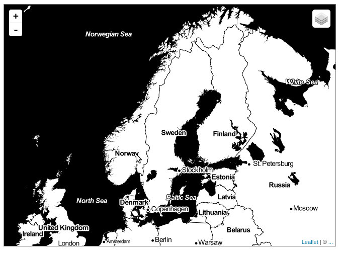
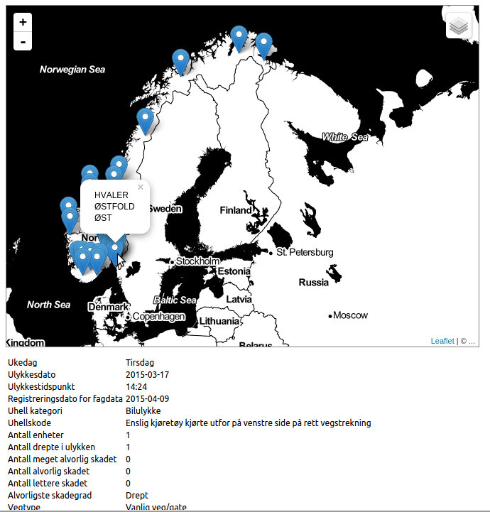
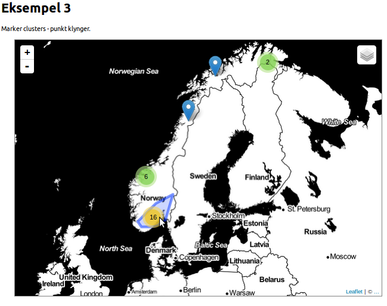

# Veiledning nr 1

Formålet med denne veiledning er å lage et simpelt kart på en webside og legge data om trafikkulykker fra Vegvesenet på. 

Nødvendig kode og filer er tilgjengelig på [github](https://github.com/GeoForum/veiledning01). Du kan bygge opp filstrukturen selv eller bruke filene i denne veiledning.

Følge evt [denne instruks](testserver.md) hvis du vil sette opp lokal test-server.

## Eksempel 1

### Lag et kart med LeafletJS
Last ned [leafletjs](http://leafletjs.com/download.html) og legg filene et passende sted under "doc root" på ditt site - her er valgt å legge javascript filer unde `js/` og ccs filer under `css/`. Lag en html fil - [se eksempel01.html](eksempel01.html) som linker til leaflet filene og andre ressurser.

```html
<link rel="stylesheet" type="text/css" href="css/leaflet.css">
<script type="text/javascript" src="js/vendor/leaflet.js"></script>
<script type="text/javascript" src="js/eks01.js"></script>
```
eller bruk alternativt hosted versjon av filene:
```html
<link rel="stylesheet" href="http://cdn.leafletjs.com/leaflet-0.7.3/leaflet.css" />
<script src="http://cdn.leafletjs.com/leaflet-0.7.3/leaflet.js"></script>
<script type="text/javascript" src="js/eks01.js"></script>
```

Html dokumentet skal inneholde et element som kartet renderes i, her `<div class="map" id="map"></div>`, deretter lages et kart med 3 lag - se [js/eks01.js](js/eks01.js):

```js
var layers = [];
var osm = L.tileLayer('http://{s}.tile.osm.org/{z}/{x}/{y}.png', {
    attribution: '&copy; <a href="http://osm.org/copyright">OpenStreetMap</a> contributors'
});
var watercoler = L.tileLayer('http://{s}.tile.stamen.com/watercolor/{z}/{x}/{y}.jpg', {
    attribution: '&copy; <a href="http://maps.stamen.com">Stamen</a>'
});
var toner = L.tileLayer('http://{s}.tile.stamen.com/toner/{z}/{x}/{y}.jpg', {
    attribution: '&copy; <a href="http://maps.stamen.com">Stamen</a>'
});
layers.push(osm, watercoler, toner);
var map = app.map = L.map('map', {
    center: [59.91235, 10.7357]
  , zoom: 11
  , layers: layers
})
```
Hvis du tester siden i din nettleser nå, vil du se, at det siste laget legger seg øverst og de andre lag ikke kan sees. For å kunne skiftet mellom lagene, tilføyes et verktøy til å skifte lag:

```js
var baseMaps = {
    "Open Street Map": osm
  , "Vannfarge": watercoler
  , "Toner": toner
};
var overlays = {};
L.control.layers(baseMaps, overlays).addTo(map);
```

Voila, du har nå et simpelt kart på siden din som ser slik ut:



## Eksempel 2

### Legg på data fra NVDB

Vegvesenet har en service med data fra [NVDB](https://www.vegvesen.no/nvdb/api/dokumentasjon) - servicen har et REST API og man kan hente ut data fx på denne mådten:

* Kan hentes i json format med [dette link](https://www.vegvesen.no/nvdb/api/sok.json?kriterie=%7B%22lokasjon%22:%7B%22bbox%22:%22-1349369,6171067,2549369,8278933%22%7D,%22objektTyper%22:%5B%7B%22id%22:570,%22filter%22:%5B%7B%22type%22:%22Alvorligste%20skadegrad%22,%22operator%22:%22=%22,%22verdi%22:%5B%22Drept%22%5D%7D,%7B%22type%22:%22Ulykkesdato%22,%22operator%22:%22%3E=%22,%22verdi%22:%5B%222015-01-01%22%5D%7D%5D%7D%5D%7D)
* Kan hentes i xml format med [dette link](https://www.vegvesen.no/nvdb/api/sok?kriterie=%7B%22lokasjon%22:%7B%22bbox%22:%22-1349369,6171067,2549369,8278933%22%7D,%22objektTyper%22:%5B%7B%22id%22:570,%22filter%22:%5B%7B%22type%22:%22Alvorligste%20skadegrad%22,%22operator%22:%22=%22,%22verdi%22:%5B%22Drept%22%5D%7D,%7B%22type%22:%22Ulykkesdato%22,%22operator%22:%22%3E=%22,%22verdi%22:%5B%222015-01-01%22%5D%7D%5D%7D%5D%7D)

Dette er et datasett med trafikkulykker fra hele landet, og vi har lagt en kopi av data her:
`data/trafikkulykker02.nvdb.json`

Følg med i koden i [eksempel02.html](eksempel02.html) og i [js/eks02.js](js/eks02.js). I dette eksemplet skal vi bruke andre komponenter - [jQuery](https://jquery.com/) og [wellknown](https://github.com/mapbox/wellknown):
```html
  <script type="text/javascript" src="js/vendor/wellknown.js"></script> 
  <script type="text/javascript" src="js/vendor/jquery.min.js"></script>
```
Først hentes json data vha jQuery ajax:

```js
$.ajax({
    url: "data/trafikkulykker02.nvdb.json"
  , dataType: "json"
})
.done(function(data){
  // ...
});
```

Koordinatene finnes i to formater i dette datasettet - hhv geometriWgs84 og geometriUtm33 - les evt mer om [kartprojeksjoner og koordinatsystem her](projeksjoner.md). Leaflet bruker i utgangspunktet WGS84 decimalgrader, og vi trenger derfor denne verdien. Den finnes her i et format kallet WKT [(Well Known Text)](http://en.wikipedia.org/wiki/Well-known_text). I disse data er det bare punkter, men WKT kan indeholde forskjellige geometrityper, her er noen eksempler:
```js
"POINT (30 10)";
"LINESTRING (30 10, 10 30, 40 40)";
"POLYGON ((30 10, 40 40, 20 40, 10 20, 30 10))";
```

Når data returneres løpes gjennom alle vegobjekter, koordinatene finnes, behandles og legges til kartet som markører, vær oppmerksom på at Leaflet vil ha koordinatene i motsatt rekkefølge. WKT og andre moderne formater følger vitenskapelig tradisjon som skriver x-koordinaten først og deretter y-koordinaten - mens Leaflet i utgangspunktet bruker tradisjonell lengde/breddegrad, hvor y (lengdegrad) kommer før x (breddegrad):

```js
var vegObr = data.resultater[0].vegObjekter;
for (var i = 0; i < vegObr.length; i++) {
  var vo = vegObr[i];
  // Vi skal ha tak i wgs84 koorinater og endre dem til geometri vha wellknown:
  var wkt84 = vo.lokasjon || vo.lokasjon.geometriWgs84 
    ? vo.lokasjon.geometriWgs84 : false;
  var wkt84Geom = wkt84 ? wellknown.parse(wkt84) : false;
  if(wkt84Geom && wkt84Geom.coordinates){
    // Leaflet vil ha koordinatene i motsatt rekkefølge av det wellknown leverer:
    var latlng = [ wkt84Geom.coordinates[1], wkt84Geom.coordinates[0] ];
  // ...
}
```

En markør kan ha en popup med valgfri tekst/html som vises når det klikkes på den:
```js
// Lag simpel info om hver ulykke og legg det til marker i kartet 
// med popup, som tilføyes kartet:
var poparr = [vo.lokasjon.kommune.navn, vo.lokasjon.fylke.navn, vo.lokasjon.region.navn];
var m = L.marker(latlng)
  .bindPopup( poparr.join('<br/>') )
  .addTo(app.map);
```

Data kan også vises et annet sted på websiden. Dette datasettet inneholder masse ekstra informasjon under "egenskaper". Både [markør](http://leafletjs.com/reference.html#marker) og [popup](http://leafletjs.com/reference.html#popup) har diverse [events](http://leafletjs.com/reference.html#events), man kan hefte ønsket funksjonalitet på - i dette eksemplet lagres informasjonen på markøren og vises i "info" elementet, når det klikkes på markøren:
```js
var $info = $('#info'), info = '<table>', egarr = vo.egenskaper;
for (var j = 0; j < egarr.length; j++) {
  var eg = egarr[j]; //, infoarr = [ eg['navn'], eg['verdi']]; 
  info += '<tr><td>' + eg['navn'] + '</td><td>' + eg['verdi'] + '</td></tr>';
};
m.nvdbInfoTxt = info + '</table>';
// Vis info tekst når markørens popup åpnes og slett teksten når den lukkes:
m.on('popupopen', function(e) {
  $info.html(e.target.nvdbInfoTxt);
});
m.on('popupclose', function(e){
  $info.text('');
});
```

Du har nå et kart som ser slik ut:


## Eksempel 3

### Lag "Point Clusters"

Som du ser på kartet ovenfor, blir det uoversiktlig når mange punkter ligger nær hverandre på kartet. Det kan derfor være lurt å bruke såkalte "point clusters" eller punkt-klynger. Til dette bruker vi komponenten [Leaflet.markercluster](https://github.com/Leaflet/Leaflet.markercluster) - det krever litt mer javascript og css:
```html
<script type="text/javascript" src="js/vendor/leaflet.markercluster-src.js"></script>
<link rel="stylesheet" type="text/css" href="css/MarkerCluster.css">
<link rel="stylesheet" type="text/css" href="css/MarkerCluster.Default.css">
```

For å få til punkt-klyngene, må vi endre litt på koden fra før - se [eksempel03.html](eksempel03.html) og [css/eks03.js](css/eks03.js). 

```js
var mcg = new L.MarkerClusterGroup();
// ...
var m = L.marker(latlng).bindPopup( poparr.join('<br/>') );
mcg.addLayer(m);
// ...
app.map.addLayer(mcg);
```

I stedet for å tilføye hver markør til kartet, tilføyes de en instans av MarkerClusterGroup som til slutt tilføyes kartet. 

Slik får du til et kart med marker clusters som på bildene her:

