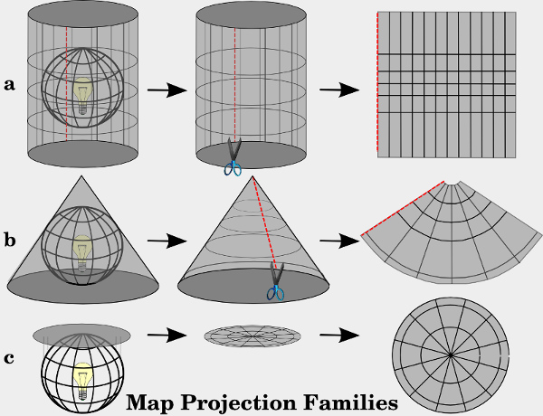

# Projeksjoner

## Kartprojeksjoner og konvertering

Jorden er en kule og både papir og skjerm er flat - og det finnes derfor mange måter å projisere data fra kule til flate på. Både leaflet og lignende (fx OpenLayers, Google Maps mv) bruker som utgangspunkt en Mercator-projeksjon med koden "EPSG:3857", mens det er vanlig i Norge å bruke UTM projeksjoner som er tilpasset lokalt bruk. Disse har fx koder som "EPSG:25832", "EPSG:32632", "EPSG:25833" og "EPSG:32633".

Åpne data i Norge er ofte tilgjengelig i lokale projeksjoner, og kan derfor være nødvendig å konvertere mellom forskjellige projeksjoner. Det kan gjøres på mange måter - bla en javascript-komponent kallet [Proj4js](http://proj4js.org/).

Vi skal ikke gå i dybden med projeksjoner i denne veiledning, men her er en kort oversikt over noen fordeler og ulemper:

#### Mercator
* Fordeler:
  * Globalt koordinatsystem.
  * Viser lett hele kloden på et kart.
* Ulemper:
  * Områder langt fra ekvator vises svært forvrengt.
  * Koordinatsystemet er ikke kvadratisk.
  * Enheten for koordinater er grader, som kan være vanskelig å lage beregninger på.

#### UTM
* Fordeler:
  * Enheten for koordinater er meter.
  * Koordinatsystemet er kvadratisk.
* Ulemper:
  * Koordinatsystemet dekker et begrenset område, en såkalt UTM-zone.

Vil du vite mer om forskjellige koordinatsystem, kan du bla lese mer her:
* http://en.wikipedia.org/wiki/Map_projection
* http://docs.qgis.org/2.0/en/docs/gentle_gis_introduction/coordinate_reference_systems.html
* http://www.sharpgis.net/post/2007/05/05/Spatial-references2c-coordinate-systems2c-projections2c-datums2c-ellipsoids-e28093-confusing
* https://en.wikipedia.org/wiki/Spatial_reference_system
* http://communityhub.esriuk.com/journal/2012/3/26/coordinate-systems-and-projections-for-beginners.html
